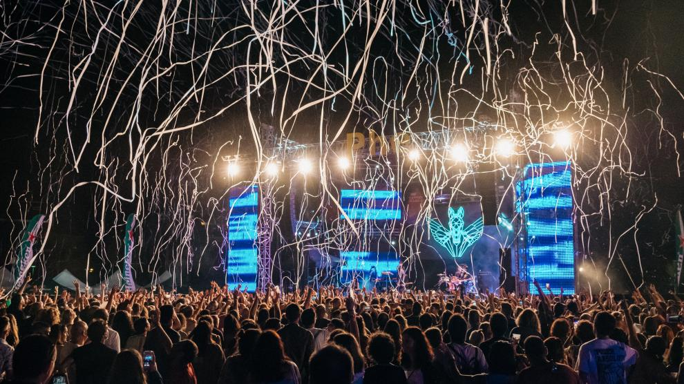

# Festivals a Europa
Mapa dels 20 festivals amb més afluència de Europa

  

## Tema
  El tema escollit per a la pàgina web ha estat una web que recolli els festivals de Europa existents.
  Aquesta motivació ve per la meva afició a la música que compaginada amb la necessitat de conèixer festivals amb diversos estils de música afavoreix al context de creació de la pàgina web.
  
## Dades
  Les dades utilitzades per a la realització de la pàgina web provenen de
  *(https//www.google.es/maps)* , i de la cerca pròpia. 
 
## Estructura
  En aquest apartar, s'explica l'estructura preliminar de la pàgina web.
  En l'apartat inicial de la web, s'ilustrarà una introducció sobre els festivals adjuntant un video de Ultra Europa, un dels festivals més coneguts del continent.
  Un altre apartat són el mapa que permet visualitzar cada festival on es situa.
  L'apartat de artistes té la funcionalitt de conèixer aquells artistes que formen part, de moment, dels nostre catàleg. Cadascuna de les imatges et redirigeix al tour de cada artista per, si hi haguessin canvis, verificar les noves dates i ubicacions (degut a que el servei encara no es troba automatitzat)
  Finalment el contacte permet establir una relació i resoldre possibles incidències.
  
## Web
https://eduardmatsegu.github.io/europe_festivals/

## Responsive
Alguns apartats si que són responsive com el dels artistes, però m'ha faltat fer un resposive per el header, ja que dos tècniques emprades no m'han donat resultat.

## Cartografia
  *La cartografía esta realitzad amb el programari lliure QGis 3.16.16*
  
   La desició de realitzar una cartografía interactiva com a base d'aquest projecte
   ve donada per la facilitat de transmetre la informació de manera visual.
   D'altra manera la recepció d'aquesta informació arribaria a ser tediosa. 
   
## Dificultats
  Primerament la primera dificultat que s'ha trobat en la realització d'aquest 
  projecte encara inclomplert ha estat clarament el desconeixement de les eines
  que permeten contruir una pàgina web: GitHub Desktop, notepad++, etc... i llenguatges com  html, css i markdown.
  En el camp de la cartografia la utilització de icones svg complica la visualització de les icones. Aquests pas es resolt amb el programari Inkscape.
  Una de les principals dificultats ha sigut la realització del projecte segons lo aprés en l'assignatura compaginant-se amb la cerca d'informació per youtube, l'ús de plantilles genera un resultat molt més profesional i estètic, però no s'aprén tot el que s'aprén si es fa per via pròpia. 
  
